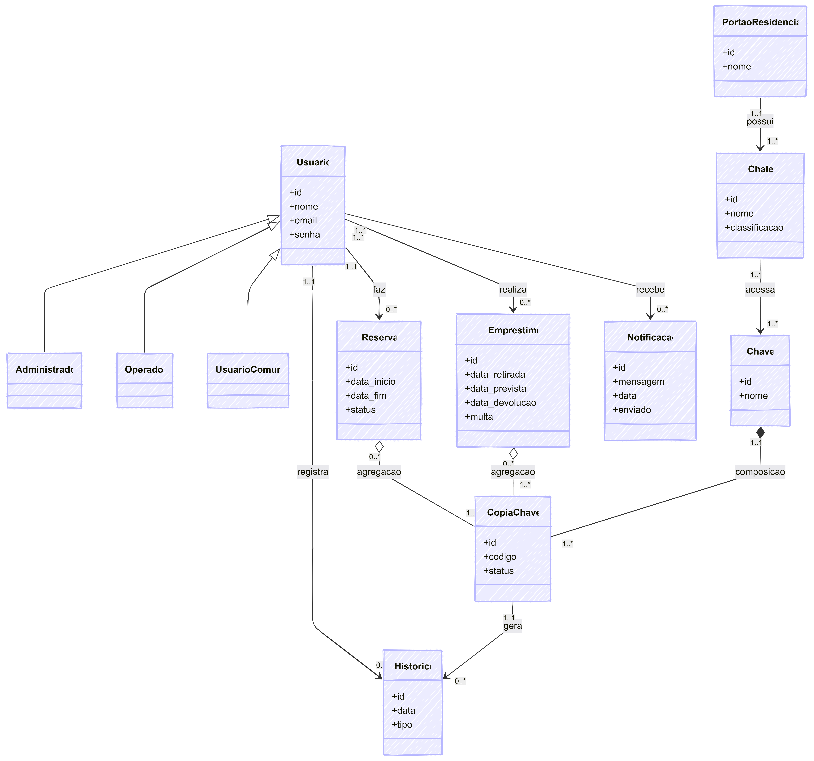

# Sistema de Gestão de Chalés - Projeto Integrador

Este repositório contém o desenvolvimento de um sistema de gerenciamento para chalés, desenvolvido como projeto integrador para a disciplina de Desenvolvimento Web no Politécnico da UFSM.

## Diagrama UML

EM BREVE...
