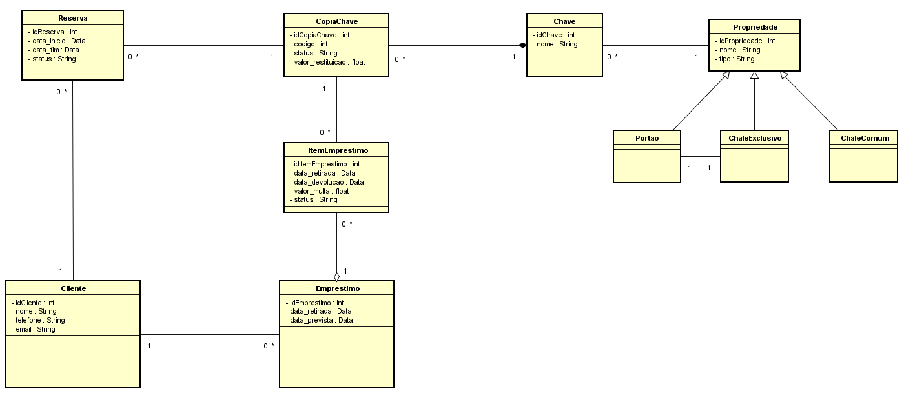

# Sistema de Gestão de Chalés - Projeto Integrador

Este repositório contém o desenvolvimento de um sistema de gerenciamento para chalés, desenvolvido como projeto integrador para a disciplina de Desenvolvimento Web no Politécnico da UFSM.

## Diagrama UML

EM BREVE...

comandos pra facilitar a minha vida:

py -3.12 -m venv .venv

.\.venv\Scripts\Activate.ps1

python -m pip install -r requirements.txt

python manage.py migrate

python manage.py runserver

p abrir no outro terminal o scheduler :

.\.venv\Scripts\Activate.ps1

python manage.py run_scheduler